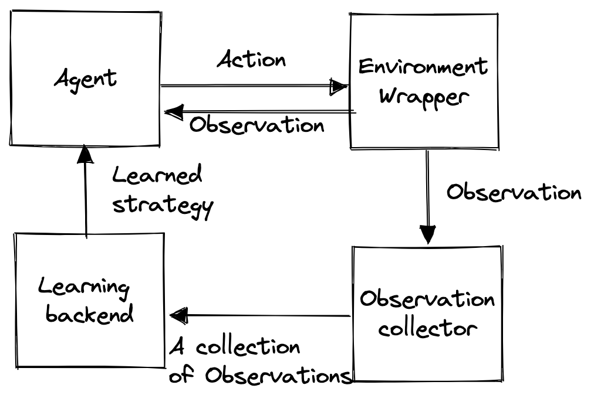
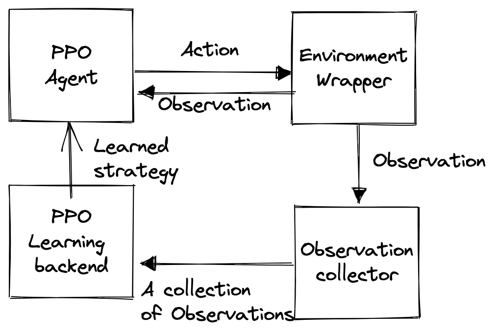
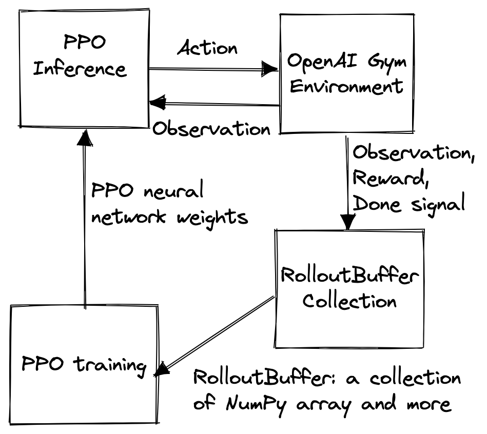

# CnF Porting Documentation

The porting of existing application to Component and Flow (CnF) requires partition application into components. CnF requires components explicitly stating its data dependency. The example we discussed in [README.md](http://README.md) gives you an understanding what data dependency means. Any pice of data transferred on a CnF graph is called a data buffer. 

### First Step:  Partition Application into Meaningful Components

The first step of porting is to determine meaningful components after we identify the main-loop of an application. In the targeted scenario of Neuroweaver, it involves at least four  major components: (1) a wrapper for interacting with the the environment, e.g. a brain or a Van der Pol oscillator simulating a brain.  (2) an agent to determine an action applying to the environment for a certain objective. For example, the objective is to suppress low frequency oscillations in the usage of deep brain stimulation. (3) a collector that collects observation from the environment, and these collected observations are passed to a learning backend. (4) a learning backend consumes the collected observations. It learns from the observations and provide a learned strategy for the agent. The diagram below shows the four components and their relations between them.



  
We follow the principle above to partition Proximal Policy Optimization (PPO) from Stable-baseline-3 into components as follow:



We first identify PPO’s main-loop at [learn()](https://github.com/DLR-RM/stable-baselines3/blob/master/stable_baselines3/ppo/ppo.py#L297) method. It’s an inherent method from its parent class [OnPolicyAlgorithm](https://github.com/DLR-RM/stable-baselines3/blob/master/stable_baselines3/common/on_policy_algorithm.py#L226). A sketch of `learn()` method can be shown as below:

```python
def learn(
        self,
        total_timesteps: int,
        callback: MaybeCallback = None,
        log_interval: int = 1,
        eval_env: Optional[GymEnv] = None,
        eval_freq: int = -1,
        n_eval_episodes: int = 5,
        tb_log_name: str = "OnPolicyAlgorithm",
        eval_log_path: Optional[str] = None,
        reset_num_timesteps: bool = True,
    ) -> "OnPolicyAlgorithm":
        iteration = 0

        total_timesteps, callback = self._setup_learn(
            total_timesteps, eval_env, callback, eval_freq, n_eval_episodes, eval_log_path, reset_num_timesteps, tb_log_name
        )

        while self.num_timesteps < total_timesteps:

            continue_training = self.collect_rollouts(self.env, callback, self.rollout_buffer, n_rollout_steps=self.n_steps)

            if continue_training is False:
                break

            iteration += 1
            self._update_current_progress_remaining(self.num_timesteps, total_timesteps)

            self.train()

        callback.on_training_end()

        return self
```

It already shows us two main steps from this main-loop. It collects rollouts and trains PPO. The `train()` is obvious. It works as the learning backend as we described.  For [collect_rollouts()](https://github.com/DLR-RM/stable-baselines3/blob/master/stable_baselines3/common/on_policy_algorithm.py#L127), we can see that it involves actually the function of an agent, environment wrapper, and observation collector. Therefore, we have to recursively dive into it.

```python
def collect_rollouts(
        self,
        env: VecEnv,
        callback: BaseCallback,
        rollout_buffer: RolloutBuffer,
        n_rollout_steps: int,
    ) -> bool:
        """
        Collect experiences using the current policy and fill a ``RolloutBuffer``.
        The term rollout here refers to the model-free notion and should not
        be used with the concept of rollout used in model-based RL or planning.
        :param env: The training environment
        :param callback: Callback that will be called at each step
            (and at the beginning and end of the rollout)
        :param rollout_buffer: Buffer to fill with rollouts
        :param n_steps: Number of experiences to collect per environment
        :return: True if function returned with at least `n_rollout_steps`
            collected, False if callback terminated rollout prematurely.
        """
        assert self._last_obs is not None, "No previous observation was provided"
        # Switch to eval mode (this affects batch norm / dropout)
        self.policy.set_training_mode(False)

        n_steps = 0
        rollout_buffer.reset()

        callback.on_rollout_start()

        while n_steps < n_rollout_steps:
            if self.use_sde and self.sde_sample_freq > 0 and n_steps % self.sde_sample_freq == 0:
                # Sample a new noise matrix
                self.policy.reset_noise(env.num_envs)

            with th.no_grad():
                # Convert to pytorch tensor or to TensorDict
                obs_tensor = obs_as_tensor(self._last_obs, self.device)
								### ACTIONS is here
                actions, values, log_probs = self.policy(obs_tensor)
            actions = actions.cpu().numpy()

            # Rescale and perform action
            clipped_actions = actions
            # Clip the actions to avoid out of bound error
            if isinstance(self.action_space, gym.spaces.Box):
                clipped_actions = np.clip(actions, self.action_space.low, self.action_space.high)

            new_obs, rewards, dones, infos = env.step(clipped_actions)

            self.num_timesteps += env.num_envs

            # Give access to local variables
            callback.update_locals(locals())
            if callback.on_step() is False:
                return False

            self._update_info_buffer(infos)
            n_steps += 1

            if isinstance(self.action_space, gym.spaces.Discrete):
                # Reshape in case of discrete action
                actions = actions.reshape(-1, 1)

            rollout_buffer.add(self._last_obs, actions, rewards, self._last_episode_starts, values, log_probs)
            self._last_obs = new_obs
            self._last_episode_starts = dones

        with th.no_grad():
            # Compute value for the last timestep
            values = self.policy.predict_values(obs_as_tensor(new_obs, self.device))

        rollout_buffer.compute_returns_and_advantage(last_values=values, dones=dones)

        callback.on_rollout_end()
```

`actions` are shown after the line `### ACTIONS is here` in the code section above. It’s obtained  by calling: 

`actions, values, log_probs = self.policy(obs_tensor)`

which takes a tensor of observation `obs_tensor` . It then turn this observation tensor into actions with PPO’s policy neural network. After the action is here, then we see the code that interacts with the environment: 

`new_obs, rewards, dones, infos = env.step(clipped_actions)`

which calls the environment wrapper `env` to  obtain a new observation along with rewards, done signal and env information.

These outputs of interacting with environment and then are further passed to `rollout_buffer`which is essentially collecting observations and its associated actions, rewards and etc. 

This workflow loops `n_rollout_steps` time until it fills all entries in a single rollout buffer. This full rollout buffer is needed for PPO's training.

### Second Step:  Construct Data Dependency Between Components

The second step is to observe the coarse-grained dataflow, i.e. flow in CnF, within the existing applications. The flow in CnF is only about the data passed from one component to another component. This depends on how you construct components in the first step. We don’t perform detailed program analysis for the porting, which will be prohibitively for users to do.

For our PPO training loop example, the flow between components can be easily derived by examining the input, output, and states of a component. We skip the part of presenting details of how we derive the flow and present the result here. 



This flow also defines how the execution of the CnF as the execution is trigger by the readiness of input (See [README.md](http://README.md) if confused). A interesting workaround needs to made to circumvent limitation of CnF.  For CnF graph with no external data input, a component needs to become the source to generate data input for the entire CnF dataflow. 

PPO inference component takes observation from OpenAI gym environment and outputs action to it. This is the same for the environment component, i.e. OpenAI gym environment, but with swapped input and output. This interlocked input/output relation forces us to not to treat them directly as input and output.  PPO inference or OpenAI gym environment both need an input to start its execution as CnF requires. We decide to make PPO inference as the source for the entire CnF’s execution. We counter-intuitively define observation from environment as state rather than input to circumvent the limitation of CnF. 

### Third Step:  Data Shape of the Flow

The third step is to determine the data shape of the flow. This can be slightly more difficult because we don’t really care about it when everything is within a single monolithic piece of program. The easiest way is to print out the shape manually. This is straightforward if your data buffer is expressed with NumPy. With NumPy, you just need to call `shape()` to get the shapes returned in a tuple. If you’re dealing with more complicated data structure. It’s recommended to deconstruct them into a collection of NumPy array.  For overly complicated data structures, we provide workaround for them, we treat them as Python objects and pickle them each time for the transfer. 

### Fourth Step:  Integrate Component and Flow with Runtime

The runtime of CnF instantiates the component and flow on CPUs and potentially GPUs and FPGAs if components are designed accordingly.  

The fourth step is to initialize the components on the runtime with proper sizing. The default values are able to handle modest workloads. For larger amount of data flowing between components, we recommend to increase `max_msg_count` which represents the max number of on-the-fly data buffer passing through the CnF graph and `max_msg_size` for the size of data buffer. 

```python
runtime.initialize(max_msg_count=1035, max_msg_size=1000000)
runtime.execute()
```

connect the flows with components. This may also give you errors as the underlying runtime sometimes needs tweak of its buffer size and the queue size.
